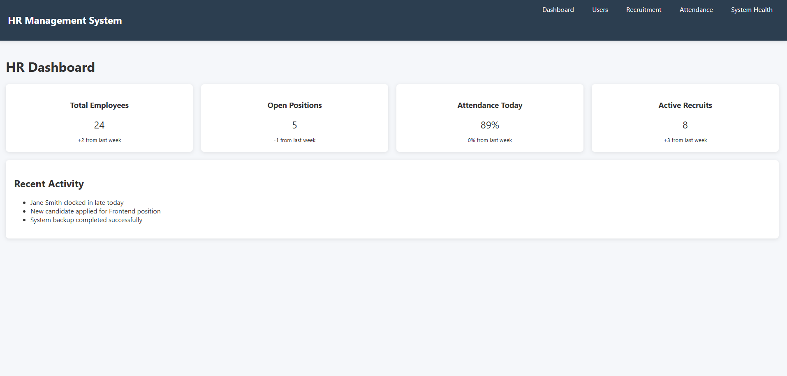

# MERN HR Management System - Deployment & DevOps

## 📌 Project Overview
A full-stack HR Management System built with the MERN stack (MongoDB, Express.js, React, Node.js), deployed with CI/CD pipelines and monitoring.

## 🚀 Deployment Details

### Backend Deployment
- **Platform:** Render
- **URL:** `https://hr-system-backend.onrender.com`
- **Technology:** Node.js/Express
- **Database:** MongoDB Atlas

### Frontend Deployment
- **Platform:** Vercel
- **URL:** `https://hr-system.vercel.app`
- **Technology:** React.js

## 📂 Application Screenshots

| Dashboard View | User Management | Recruitment | System Health |
|---------------|----------------|-------------|---------------|
|  |  |  |  |

## 🛠️ CI/CD Pipeline

### GitHub Actions Workflows
1. **Backend CI** (`backend-ci.yml`)
   - Runs tests on push to main branch
   - Checks code quality with ESLint
2. **Frontend CI** (`frontend-ci.yml`)
   - Runs React tests
   - Builds production assets
3. **Backend CD** (`backend-cd.yml`)
   - Auto-deploys to Render on successful CI
4. **Frontend CD** (`frontend-cd.yml`)
   - Auto-deploys to Vercel on successful CI

🔧 Setup Instructions
Prerequisites
Node.js v16+

MongoDB Atlas account

GitHub account

Render/Vercel accounts

Local Development

# Clone repository
git clone https://github.com/yourusername/hr-system.git
cd hr-system

# Backend setup
cd server
npm install
cp .env.example .env # Update with your credentials
npm start

# Frontend setup (in new terminal)
cd ../client
npm install
npm start

🌐 Production Deployment
Backend (Render)
Create new Web Service

Connect GitHub repository

Set environment variables:

MONGODB_URI=your_atlas_uri
PORT=5000
JWT_SECRET=your_secret

Set build command: npm install && npm run build

Set start command: node app.js

Frontend (Vercel)
Import GitHub repository

Set root directory to client

Add environment variables:

REACT_APP_API_URL=https://your-backend-url.com

Set build command: npm run build

🛡️ Monitoring Setup
Sentry for error tracking

UptimeRobot for availability monitoring

MongoDB Atlas performance metrics

Custom health endpoint: /api/health

📜 Assignment Completion Checklist
Backend deployed to cloud platform

Frontend deployed to static hosting

CI/CD pipelines implemented

Monitoring configured

Documentation complete

📚 Resources
MongoDB Atlas Documentation

Render Deployment Guide

Vercel React Deployment

GitHub Actions Docs

